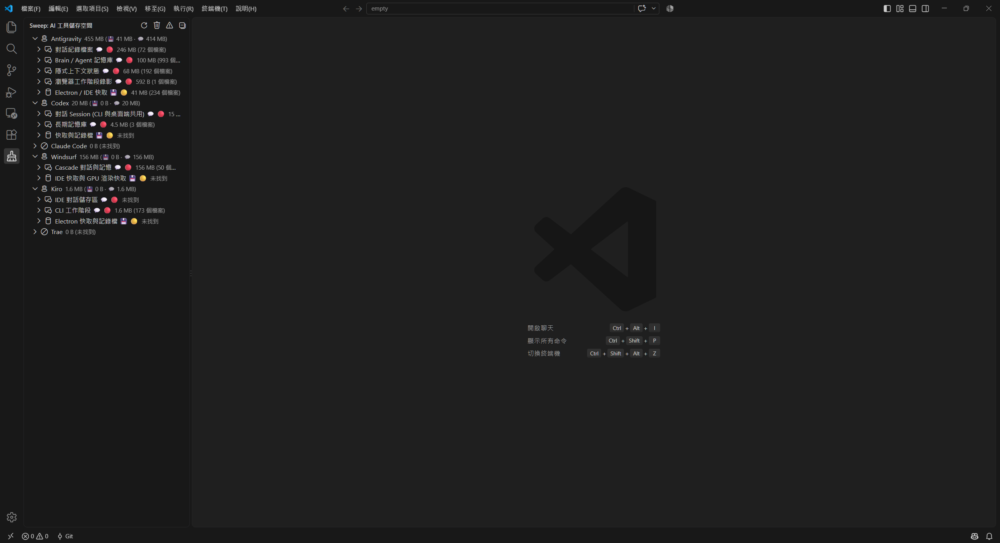
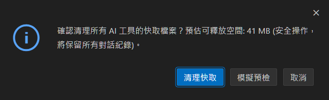

# Sweep (AI 程式碼輔助工具清理器) 🧹

> 一鍵掃描、精準分離、安全清理各大 AI 程式碼輔助工具與 AI IDE 的暫存快取及對話歷史紀錄。

<p align="left">
  <a href="README.md">English</a> |
  <a href="README.zh-CN.md">简体中文</a> |
  <strong>繁體中文</strong>
</p>

[](LICENSE)
[](https://github.com/L1r1h28/Sweep-agentcli-ide-cleaner/actions/workflows/ci.yml)
[](package.json)

隨著 AI 輔助開發工具（如 Antigravity、Codex、Claude Code、Windsurf 等）的頻繁使用，本地磁碟常迅速累積數 GB 的 Electron 快取、GPU 暫存、IndexedDB、以及極度龐大的對話歷史與 Agent 記憶。

**Sweep** 提供統一的跨平台核心引擎、CLI 終端工具與 VS Code / Cursor 擴充套件，幫助開發者精準管理 AI 存儲空間，防止誤刪沙盒運行環境與擴充插件。

---

## ✨ 核心特色

- 🎯 **精準分類（Cache vs Conversations）**：
  - 💾 **Cache（低風險）**：Electron 快取、GPU 暫存、IndexedDB、知識圖譜快取，可隨時安全釋放。
  - 💬 **Conversations（高風險）**：Agent 記憶（Brain）、對話資料庫（SQLite）、Session 紀錄，清理時具備強制安全防護。
- 🛡️ **白名單保護機制（Never-Delete Guard）**：
  - 嚴格保護設定檔（`settings.json`、`config.toml`、`mcp_config.json`、`auth.json` 等）。
  - 嚴格避開執行環境與擴充套件目錄（如 Codex 的 `.sandbox-bin` 沙箱二進位檔、Kiro 的 `~/.kiro/extensions` 插件庫）。
- 🗄️ **自動備份防護**：破壞性清除對話紀錄前，預設自動封存至 `~/.sweep/backups/`。
- 🔍 **支援 Dry-Run 模擬**：在未實際異動磁碟前預覽可釋放空間與檔案清單。
- 🌐 **跨平台支援**：完整支援 Windows、macOS 與 Linux。
- 📦 **Monorepo 多套件架構**：提供核心共享模組、獨立 CLI 執行檔與 VS Code Extension。

---

## 🛠️ 支援的 AI 工具矩陣

| 工具 | 涵蓋產品 | 磁碟佔用重點 | 保護項目（絕對不刪） |
| :--- | :--- | :--- | :--- |
| **Google Antigravity** | IDE, Desktop 2.0, CLI (`agy`) | `brain/`、`conversations/` (.pb/.db)、`WebStorage` | `bin/`、`config/`、`builtin/` |
| **OpenAI Codex** | CLI, Desktop App | `sessions/` (JSONL)、`memories/`、`thread_history` | `.sandbox-bin/` (沙盒環境)、`auth.json` |
| **Anthropic Claude Code** | CLI, VS Code/JetBrains, Desktop | `projects/` (Session JSONL)、`file-history/` | `settings.json`、`CLAUDE.md` |
| **Codeium Windsurf** | IDE, Cascade | `cascade/` (對話與記憶)、`CachedData` | `mcp_config.json` |
| **AWS Kiro** | IDE, CLI | `kiro.kiroagent` (.chat)、`sessions/` | `~/.kiro/extensions/` (插件)、`steering/` |
| **ByteDance Trae** | IDE, SOLO | `database.db` (SQLite WAL 組)、`CachedData` | 專案內 `.trae/` 設定 |

> 詳細目錄結構與容量分析請參閱 [AI IDE 儲存路徑參考文件](docs/storage-paths.md)。

---

## 📥 下載與安裝 (Download)

您可直接至 **[GitHub Releases](https://github.com/L1r1h28/Sweep-agentcli-ide-cleaner/releases)** 下載預先編譯好的免安裝執行檔（無需安裝 Node.js 環境）或 VS Code 擴充套件檔（`.vsix`）：

### 方法 1：直接下載預編譯執行檔與 VSIX (推薦)

| 平台 / 編輯器 | 下載檔案 | 安裝與使用方式 |
| :--- | :--- | :--- |
| **Windows x64** | `sweep-windows-x64.exe` | 下載後直接在 PowerShell / CMD 中執行（如 `.\sweep-windows-x64.exe scan`） |
| **macOS (Apple Silicon)** | `sweep-darwin-arm64` | `chmod +x sweep-darwin-arm64 && ./sweep-darwin-arm64 scan` |
| **macOS (Intel)** | `sweep-darwin-x64` | `chmod +x sweep-darwin-x64 && ./sweep-darwin-x64 scan` |
| **Linux x64** | `sweep-linux-x64` | `chmod +x sweep-linux-x64 && ./sweep-linux-x64 scan` |
| **VS Code / Cursor / Trae** | `sweep-aicleaner-1.0.0.vsix` | 於編輯器擴充面板選擇「從 VSIX 安裝...」或執行 `code --install-extension <檔名>.vsix` |

### 方法 2：透過 Node.js / npm

```bash
# 從原始碼直接執行
node packages/cli/src/cli.mjs scan

# 或編譯打包並全域安裝
cd packages/cli && npm pack
npm install -g aicleaner-cli-1.0.0.tgz
```

---

## 🚀 快速開始

### 1. CLI 終端機工具使用


Sweep CLI 註冊 `sweep` 與 `aicleaner` 兩個指令名稱：

```bash
# 掃描全部 AI 工具的磁碟佔用狀況
sweep scan

# 詳細顯示每個目標路徑與檔案數
sweep scan --verbose

# 僅掃描指定工具（可輸出 JSON）
sweep scan --tool antigravity --json

# 模擬清理（Dry-run 預覽，不刪除任何檔案）
sweep clean --kind cache --dry-run
sweep clean --kind conversations --dry-run

# 一鍵安全清理所有工具快取
sweep clean --kind cache --force

# 細緻化對話清理：清理 30 天前的舊對話（保留近期活躍 Session）
sweep clean --kind conversations --older-than 30d --force

# 細緻化對話清理：清理膨脹的大型 Session (>50MB)
sweep clean --kind conversations --min-size 50mb --force

# 檢視個別 Session 列表（顯示所屬工具、專案、建立天數與容量大小）
sweep sessions list
sweep sessions list --older-than 30d --min-size 10mb --project my-project

# 對話封存與匯出：將指定 Session 匯出為好讀的 Markdown 或結構化 JSON
sweep sessions export <sessionId> --format md --out ./exports

# 刪除特定篩選條件之對話 Session（預設自動建立備份）
sweep sessions clean --older-than 30d --force
```

#### CLI 指令參數表

| 指令 / 參數 | 說明 |
| --- | --- |
| `scan` | 掃描並統計全體儲存佔用（快取與對話歷史） |
| `clean` | 執行清理流程（需指定 `--kind` 或細部過濾參數） |
| `sessions [list\|clean\|export]` | 細緻化對話 Session 檢視、篩選、清理與匯出封存 |
| `tools` | 列出支援的 AI 工具、簡介與清理注意事項 |
| `targets` | 列出所有受納管的目錄路徑與風險等級 |
| `--kind <k>` | 目標類別：`cache` (快取)、`conversations` (對話歷史)、`all` (全部) |
| `--tool <id>` | 限定單一工具：`antigravity`、`codex`、`claude-code`、`windsurf`、`kiro`、`trae` |
| `--older-than <dur>` | 篩選超過指定時間之 Session（例如 `7d`, `30d`, `2w`, `1m`, `90d`） |
| `--newer-than <dur>` | 篩選小於指定時間之 Session |
| `--min-size <size>` | 篩選大於指定容量之 Session（例如 `50mb`, `100kb`, `1gb`） |
| `--max-size <size>` | 篩選小於指定容量之 Session |
| `--project <name>` | 依專案或工作區關鍵字篩選 Session |
| `--format <md\|json>` | 指定 Session 匯出格式（Markdown 或 JSON） |
| `--out <dir>` | 指定 Session 匯出儲存目標目錄 |
| `--dry-run` | 僅列出待清理檔案清單與容量，不實際刪除 |
| `--force` | 確認執行刪除（防止誤觸之安全防護） |
| `--no-backup` | 刪除對話時跳過自動封存備份 |
| `--json` | 以標準 JSON 格式輸出（適用於 `scan` 與 `sessions list`） |

---

### 2. VS Code 擴充套件

在 VS Code 或相容 IDE（如 Cursor / Trae / Windsurf）中安裝 `sweep-aicleaner`：

1. 側邊欄點擊 **Sweep** 圖示開啟專屬面板。
2. 點擊頂部 **Scan storage** 掃描本地儲存佔用。
3. 可針對個別工具執行 **Clean cache** 或 **Clean conversations**。
4. 支援快速查看自動備份目錄。



*安全操作確認與模擬預檢視窗：*



---

## 📂 專案架構 (Monorepo)

本專案採用 npm workspaces 進行多套件管理：

```text
Sweep-agentcli-ide-cleaner/
├── packages/
│   ├── core/               # 共享核心模組 (Catalog、Path Resolver、Scanner、Cleaner)
│   ├── cli/                # 跨平台 CLI 工具 (npm bin: sweep / aicleaner)
│   └── vscode-extension/   # VS Code 擴充套件 (Activity Bar UI & Commands)
├── docs/
│   └── storage-paths.md    # 完整磁碟目錄掃描與路徑分析文件
├── .github/workflows/      # CI 測試與 GitHub Releases 自動打包工作流
├── package.json            # Monorepo 根目錄配置
└── LICENSE                 # MIT 授權條款

```

---

## 💻 開發與建置

### 環境需求

* **Node.js**: `>= 18.0.0`
* **npm**: `>= 8.0.0`
* *(可選)* **Bun**: 用於編譯獨立單一執行檔 (Standalone Binaries)

### 安裝依賴與建置

```bash
# 安裝所有 Workspace 依賴
npm install

# 執行全專案建置 (Core + CLI + Extension)
npm run build

# 執行單元測試 (Vitest)
npm run test

```

### 打包與發布

```bash
# 打包 CLI 套件
cd packages/cli && npm pack

# 打包 VS Code 擴充套件 (.vsix)
cd packages/vscode-extension
npx @vscode/vsce package --no-dependencies --allow-missing-repository

```

---

## ⚠️ 安全性與免責聲明

* **對話刪除不可逆**：AI Agent 的 Memory、Transcripts 與 SQLite 對話庫一旦刪除將無法在 IDE 內復原對話上下文（除非從 `~/.sweep/backups/` 還原）。
* **共用目錄警告**：OpenAI Codex CLI 與 Desktop App 共用 `~/.codex/sessions`，刪除對話將同時影響終端與桌面客戶端。
* **關閉 IDE 後清理**：清理 Trae 等使用 SQLite WAL 模式（`database.db`, `database.db-wal`, `database.db-shm`）的工具時，建議先完全關閉 IDE。

---

## 📄 授權條款與銘謝

- 本專案基於 [MIT License](LICENSE) 條款開源發布。
- 圖示基於 [Lucide](https://lucide.dev)（[ISC License](https://github.com/lucide-icons/lucide/blob/main/LICENSE)）。
