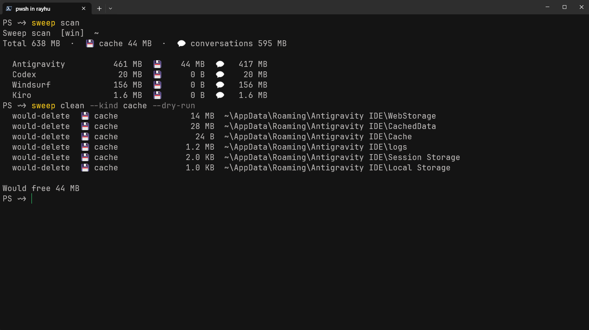

# @l1r1h28/sweep-cli 💻

> Cross-platform CLI companion for Sweep — scan, inspect, and safely clean AI IDE caches and conversation databases directly from your terminal.

[](../../LICENSE)
[](https://www.npmjs.com/package/@l1r1h28/sweep-cli)

`@l1r1h28/sweep-cli` provides the `sweep` and `aicleaner` commands. It leverages `@l1r1h28/sweep-core` to give developers fast, scriptable access to storage inspection and cleanup operations.



---

## ⚡ Installation & Execution

### 1. Run via npx / npm (Instant & Always Up-to-Date)

```bash
# Run directly without installation
npx @l1r1h28/sweep-cli scan

# Or install globally
npm install -g @l1r1h28/sweep-cli
sweep scan
```

### 2. Direct Download (Pre-built Single Executable Binaries)

No Node.js runtime required! Download zero-dependency binaries for your operating system directly from **[GitHub Releases](https://github.com/L1r1h28/Sweep-agentcli-ide-cleaner/releases)**:
- **Windows x64**: `sweep-windows-x64.exe`
- **macOS (Apple Silicon)**: `sweep-darwin-arm64`
- **macOS (Intel)**: `sweep-darwin-x64`
- **Linux x64**: `sweep-linux-x64`

```bash
# Example (Linux/macOS):
chmod +x sweep-linux-x64
./sweep-linux-x64 scan
```

---

## 📖 Command Guide

`@l1r1h28/sweep-cli` registers two command aliases: `sweep` and `aicleaner`.

```text
Usage:
  sweep [--version] | <command> [flags]
  sweep scan      [--tool <id>] [--json] [--verbose]
  sweep clean     --kind cache|conversations|all [--tool <id>] [--dry-run] [--force] [--no-backup]
                  [--older-than <dur>] [--min-size <size>] [--project <name>]
  sweep sessions  [list|clean|export] [flags]
  sweep backups   [list|prune] [flags]
  sweep restore   [<id>|latest] [--tool <id>] [--force] [--dry-run]
  sweep config    [path|list|get|set] [args]
  sweep whitelist [list|add|remove] <value>
  sweep tools     [--verbose]
  sweep targets   [--tool <id>]
  sweep help
```

### 1. `sweep scan`
Measures and prints storage breakdown across all supported AI tools.

```bash
# Basic summary table
sweep scan

# Detailed tree with paths, size per target, and file counts
sweep scan --verbose

# Scan a single tool and output JSON format for scripts/CI
sweep scan --tool codex --json
```

### 2. `sweep clean`
Executes cleaning on caches, conversations, or both. **Dry-run mode is enabled by default unless `--force` is provided.**

```bash
# Preview what cache files would be removed (Dry-Run)
sweep clean --kind cache --dry-run

# Actually clean all safe caches (Electron/GPU/IndexedDB caches)
sweep clean --kind cache --force

# Clean conversation history with automatic backup to ~/.sweep/backups/
sweep clean --kind conversations --force

# Granular conversation cleaning: filter older than 30 days
sweep clean --kind conversations --older-than 30d --force

# Target only a specific tool
sweep clean --tool windsurf --kind cache --force
```

### 3. `sweep sessions`
Granular inspection, filtering, cleaning, and export of chat sessions.

```bash
# List top 20 sessions (with output folding)
sweep sessions list

# List all sessions without folding
sweep sessions list --all

# Filter sessions by age, size, and project
sweep sessions list --older-than 30d --min-size 10mb --project my-project

# Export conversation session to readable Markdown or JSON
sweep sessions export <sessionId> --format md --out ./exports

# Clean filtered sessions
sweep sessions clean --older-than 30d --force
```

### 4. `sweep backups` & `sweep restore`
Inspect, prune, and restore local backup snapshots stored in `~/.sweep/backups/`.

```bash
# List all local backups
sweep backups list

# Prune backups older than 14 days while keeping the latest 5
sweep backups prune --older-than 14d --keep-latest 5 --force

# One-click restore from latest snapshot
sweep restore latest --force

# Restore specific tool from targeted backup timestamp
sweep restore 2026-08-31T06-00-00 --tool claude-code --force
```

### 5. `sweep config` & `sweep whitelist`
Inspect and update persistent configuration settings and protection whitelists (`~/.sweep/config.json`).

```bash
sweep config list
sweep config set hideUninstalledTools true
sweep whitelist list
sweep whitelist add my-secret-project
sweep whitelist remove my-secret-project
```

---

## 🛡️ Flags & Options

| Flag | Type | Description |
| :--- | :--- | :--- |
| `--kind <type>` | `cache` \| `conversations` \| `all` | Target data category for cleanup. |
| `--tool <id>` | string | Limit operation to a single tool product line. |
| `--limit <n>` / `-n <n>` | number | Paginate session list to top N items (prevents terminal flooding). |
| `--all` / `-a` | boolean | Display all items without output folding. |
| `--older-than <dur>` | duration | Filter items older than duration (e.g., `7d`, `14d`, `30d`, `90d`). |
| `--newer-than <dur>` | duration | Filter items newer than duration. |
| `--min-size <size>` | size | Filter items larger than size (e.g., `50mb`, `100kb`, `1gb`). |
| `--max-size <size>` | size | Filter items smaller than size. |
| `--project <name>` | string | Filter sessions matching project/workspace keyword. |
| `--keep-latest <n>` | number | Retain the most recent N backups during prune. |
| `--dry-run` | boolean | Preview files that would be deleted without making disk changes. |
| `--force` | boolean | Confirms deletion or restore overwrite. |
| `--no-backup` | boolean | Disables automated backup archive when cleaning conversations. |
| `--json` | boolean | Output results as formatted JSON. |
| `--verbose` / `-v` | boolean | Display detailed path, target, and product information. |

---

## ⚠️ Safety Defaults

- **Dry-run by Default**: `sweep clean` requires `--force` to prevent accidental deletion.
- **Protected Environment Guard**: Codex runtime (`.sandbox-bin/`), Kiro extensions (`.kiro/extensions`), Trae rules (`skills/`), and configuration files (`*.json`, `*.toml`, `*.md`) are permanently excluded and can never be deleted.

---

## 📄 License

MIT © [L1r1h28](../../LICENSE)